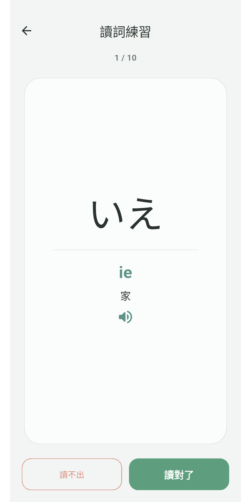

# Kotonoha 言の葉

**English** · [繁體中文](README.zh-TW.md) · [日本語](README.JP.md)

> A calm, minimal companion for learning to read Japanese kana.

Kotonoha is an adult-friendly trainer for reading Japanese kana. In a quiet two
minutes a day, it builds the reflex from glyph to sound — across all 208 hiragana
and katakana — and then lets you read small words in context.

It is deliberately unhurried. No streaks, no badges, no XP, no mascots, no
confetti. Just you, the kana, and a notebook-quiet space to practise. The whole
app is built with Flutter.

## Screenshots

| Home | Today's session | Reading | Progress |
|:---:|:---:|:---:|:---:|
|  |  |  |  |

## How a day looks

Open the app and tap **today's session** — one adaptive run that automatically
mixes what's due for review, what you've been weak on, and a little that's new.
There's nothing to configure; you just begin. Two minutes later, you're done.

## What's inside

- **All 208 kana** — hiragana and katakana, including dakuten, handakuten, and
  yōon, taught one row at a time as sequential lessons.
- **Today's session** — a single adaptive practice that composes itself from
  your own data, so you never have to choose a mode.
- **Look-alike drill** — targeted practice for the kana that are easy to confuse
  (ね / れ / わ, さ / ち, …).
- **Reading practice** — read small words built from the kana you've unlocked,
  with audio, to get comfortable in context.
- **Paper handwriting recall** — pairs with a physical practice book: see a
  prompt, write it on paper, reveal, and self-grade.
- **Native audio** — tap any kana or word to hear it (Japanese text-to-speech).
- **Quiet progress** — see your accuracy and which kana are strong or weak,
  without a single guilt-trip.
- **Private by design** — no account, no network, no ads. Everything stays on
  your device.

## Platforms

Built with Flutter for **Android** and **iOS**.

## License

[MIT](LICENSE) · © 2026 Koopa
