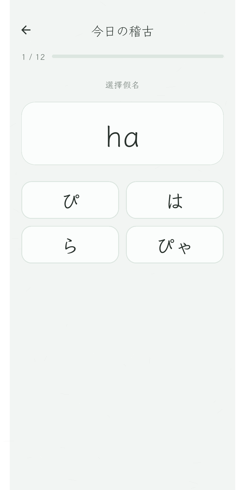
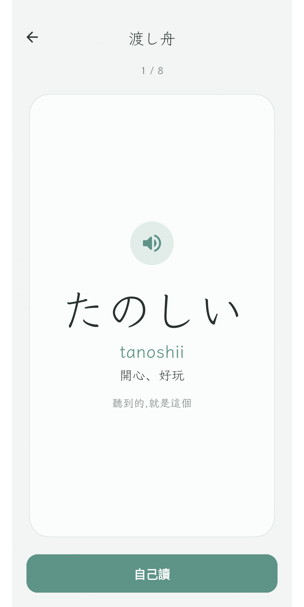
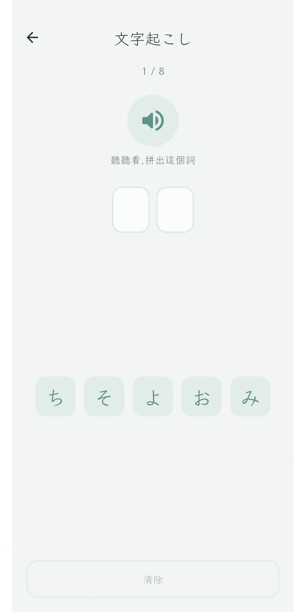
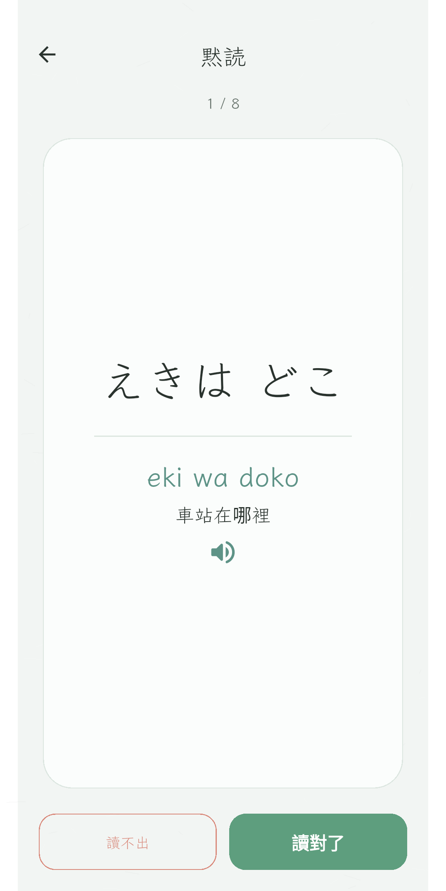
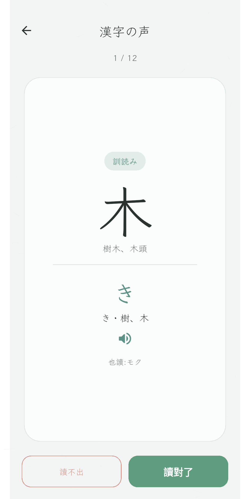
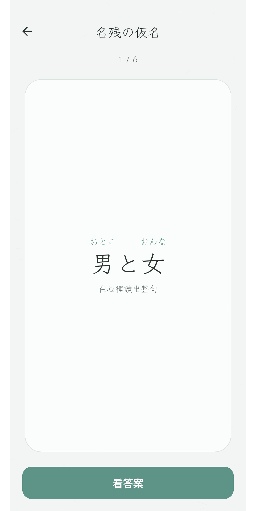

  

# 言の葉 · Kotonoha

[English](README.md) · **繁體中文** · [日本語](README.JP.md)

> 沉靜、極簡,陪你學會「讀」日文。

---

言の葉(ことのは,「言詞之葉」)是一個為成人設計的日文**閱讀**練習。每天安靜的幾分鐘,
建立「看到字形就反射出聲音」的直覺 —— 涵蓋全部 208 個平假名與片假名 —— 再帶你走進小詞、
短句,以及漢字讀音的第一步。

它刻意不急不躁。沒有連續天數、沒有徽章、沒有 XP、沒有吉祥物、沒有彩帶動畫。只有你、
假名,和一個像筆記本一樣安靜的練習空間 —— 雨後庭園的青磁綠,落在和紙上。整個 app 以
Flutter 打造,完全在你的裝置上執行,不需要任何帳號。

## 畫面截圖

| 言の葉(首頁) | 今日の稽古(每日) | 渡し舟(擺渡) | 文字起こし(聽寫) |
|:---:|:---:|:---:|:---:|
|  |  |  |  |
| **黙読(讀句)** | **漢字の声(漢字音)** | **名残の仮名(漢字句)** | **歩み(進度)** |
|  |  |  |  |

## 一天的樣子

打開 app,點「**今日の稽古**」(今天的練習)—— 一段自適應的練習,自動混合「該複習的」、
「比較弱的」、和「一點點新的」。什麼都不用設定,直接開始。幾分鐘後,練習歸於
「**凪**」(なぎ)—— 一個安靜、無言的收尾。

## 內容

每個練習都帶著一個安靜的日文名字,而 app 會用白話告訴你它實際做什麼。

- **手解き — 學假名。** 全部 208 個平假名與片假名,含濁音、半濁音、拗音,一行一行循序學。
- **今日の稽古 — 今天的練習。** 一段依你自己的資料自動組成的自適應練習,你永遠不必選模式。
- **渡し舟 — 擺渡。** 為「耳朵跑在眼睛前面」的你:先聽一個詞,看著它的假名在餘音中浮現,
  再自己讀出來。把聲音擺渡到它的字形。
- **文字起こし — 聽寫。** 聽一個詞,用假名磚把它拼出來 —— 辨認給不了的「產出」練習。
- **黙読 — 讀句。** 在心裡讀一句短句,再揭曉讀音、意思與發音。
- **目利き — 辨形。** 專練長得像、容易看錯的假名(シ / ツ、ね / れ / わ …)。
- **手習い — 紙上手寫。** 搭配實體習字本:看題目 → 在紙上寫 → 翻開對答案 → 自評。
  (沒有螢幕辨識,只用紙筆。)
- **漢字の声 — 漢字讀音。** 替漢字找回它的日語之聲:依提示回憶音読・訓読。
- **名残の仮名 — 漢字句。** 讀真正帶漢字與注音的句子 —— 注音會隨你熟練,一個個悄悄淡出。
- **五十音図 — 假名全表。** 瀏覽整張音節表,點任一個看細節。
- **歩み 與 自画像 — 安靜的回望。** 看你走了多遠,以及一幅淡淡的自畫像:你常把哪些假名
  看錯、反應的快慢如何沉澱 —— 不帶任何罪惡感。

每個假名、詞、句子都能點一下,聽日語原生發音。

## 天生私密

無帳號、無網路、無廣告。你的進度、你的練習紀錄,全都留在你的裝置上。

## 平台

以 Flutter 打造,支援 **Android** 與 **iOS**。

## 授權

[MIT](LICENSE) · © 2026 Koopa
