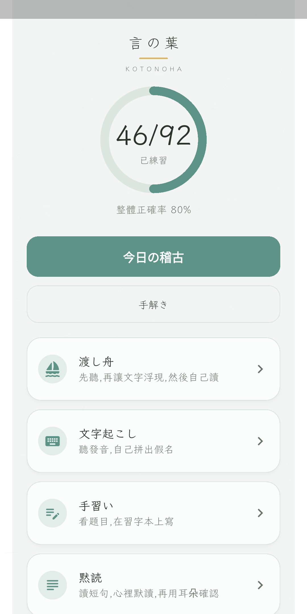
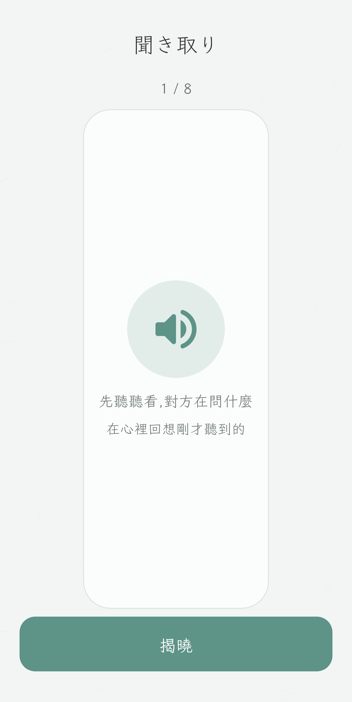
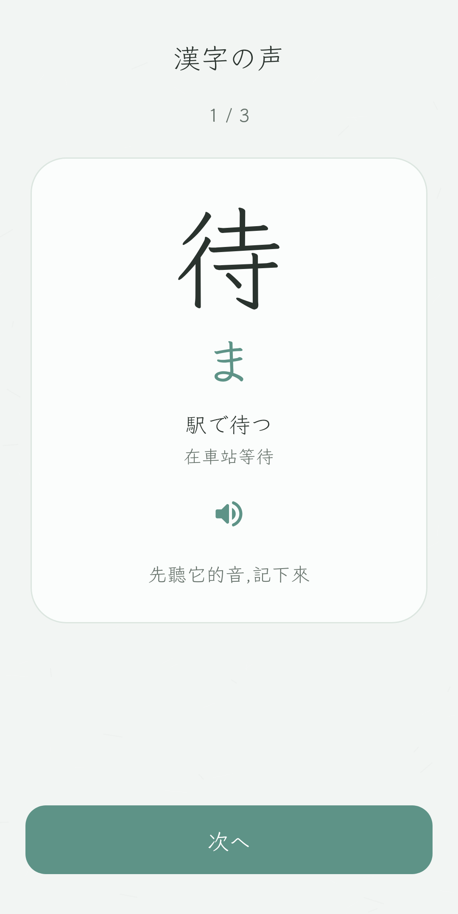
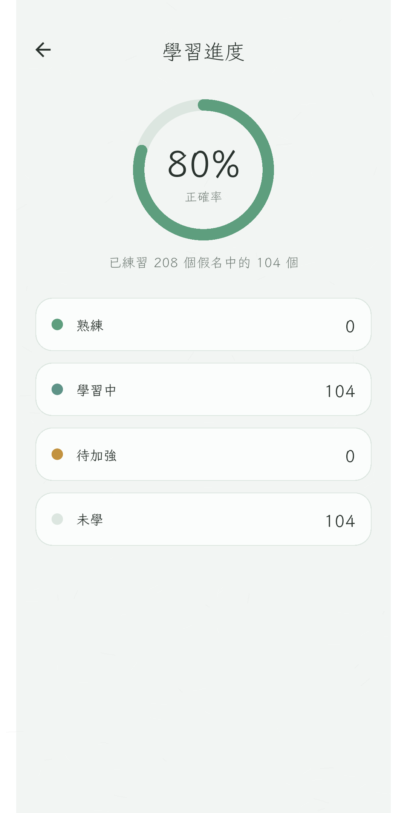

  

# 言の葉 · Kotonoha

[English](README.md) · **繁體中文** · [日本語](README.JP.md)

為繁體中文讀者設計的日語閱讀練習 app。先熟悉平假名、片假名，再走進單字、短句、
先聽再揭曉的聽力，以及詞句中的漢字讀音。每回練習簡短，介面安靜，
不追逐分數、連續天數或獎勵。

## 適合誰

已經能讀繁體中文，希望日語文字慢慢變得讀得動 —— 不是文法課、不是計分板，
也不附帶付費教材全文或真人錄音。

## 練習怎麼走

手解き一行一行帶你認假名。今日の稽古複習已經見過的假名：熟悉的會離開選擇題，
改成無提示回想。若有重用這些假名、且已經見過的詞或讀得動的短句，可能再接一題
轉移練習；並非每回都有。沒有可用的詞句時，這一回就停在假名。

假名拼得出詞之後，渡し舟用耳朵介紹單字，文字起こし請你自己拼出來，
**聞き取り**（先聽再揭曉）則播放已見過的車站用語，先藏起文字，再讓你揭曉、重聽。
旅の場面可依交通、購衣、神社古城或入園排隊，選這一回要練的詞句，先見面再回想或聽。
也可留下一到兩個旅行重點，首頁會先做一回必要的假名補強，再接選定場景；不必先學完所有假名。
換句用原創變化句換一個詞，分開確認讀音與句意，是自評，不是系統打分。
漢字の声在 app 自己的詞句裡教讀音、再回想，不是逐字抽離的單字卡。
其他房間 —— 相似字形、紙上默寫、五十音圖、短句、漢字句 —— 等你用得上才開。
歩み是接觸範圍的地圖，不是成績單。

發音使用裝置的日語文字轉語音引擎；有沒有聲音、能不能離線，取決於已安裝的語音。
進度存在本機。無須帳號，也沒有廣告。

  
  

  首頁 · 示例進度&emsp;·&emsp;聞き取り — 先聽，再揭曉

  
  

  漢字の声 — 詞句中的讀音&emsp;·&emsp;歩み — 接觸範圍，不是分數

以 Flutter 打造，支援 Android 與 iOS。

## 授權

程式：[MIT](LICENSE) · © 2026 Koopa。Klee One 字型：[SIL OFL 1.1](assets/fonts/OFL.txt)。
